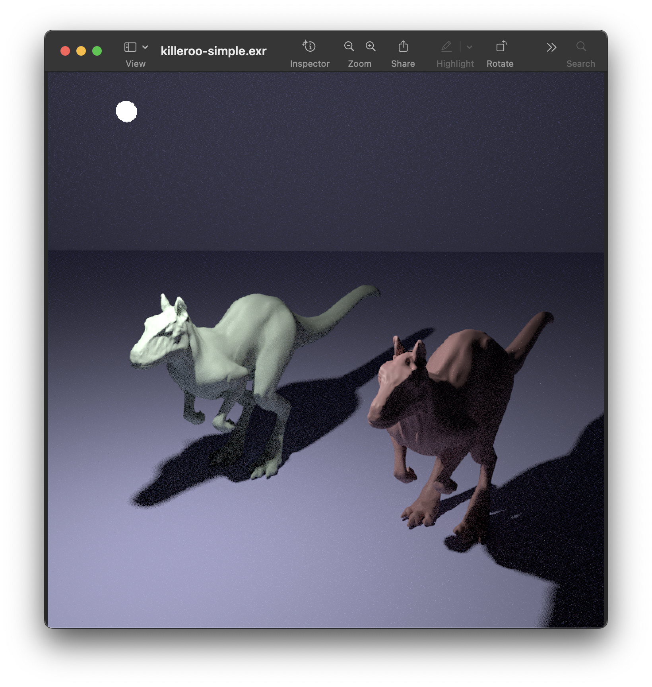

# 1. Introduction exercise


1.1 pbrt를 이해하기 위한 좋은 방법으로 하나의 광선에 대해 방사 값의 계산 과정을 디버거(debugger)로 따라 가보는 것이다. 디버깅 심볼(debugging symbol)을 포함한 pbrt 버전을 생성하고 pbrt에서 ```scenes/``` 디렉터리에 있는 ```killeroo-simple.pbrt``` 장면을 실행하자. ```SamplerIntegrato::Render()``` 메서드에 중지점 (breakpoint)을 설정하고, 어떻게 광선이 생성되고 어떻게 방사 값이 계산되고 어떻게 광선의 영향이 이미지에 더해지는지를 추적해보자. 처음에 이것을 시도할 때 실행 스레드를 하나만 생성하기 위해 ```--nthreads 1```를 커맨드라인 인수로 pbrt에 제공한다. 이를 통해 모든 계산이 주 처리 스레드에서 처리돼 어떤 일이 일어나는지 이해하기 훨씬 쉬워지며, 쉬워지는 정도는 디버거가 얼마나 쉽게 여러 스레드에서 실행되는 프로그램의 처리 단계를 따라가기 쉽게 해주는지에 따라 다르다. 이 책의 뒷부분을 통해 시스템의 세부 사항에 대한 이해가 깊어질수록 이 과정을 반복해 시스템의 특정한 부분을 더욱 신중히 추적하자.  

Sol :   
먼저 이 [link](https://github.com/mmp/pbrt-v3)로 가서 ```pbrt-v3```를 clone 한다.  
그리고 아래의 command를 사용한다. (필자의 laptop은 M1 pro chip을 탑재한 Macbook이다.)
```bash
$ git clone --recursive https://github.com/mmp/pbrt-v3 
```

다음, ```pbrt-v3``` 디렉토리로 이동하여 빌드한다. 아래의 명령어를 입력한다.
```bash
$ cd pbrt-v3 
$ mkdir build
$ cd build 
$ cmake .. -DCMAKE_BUILD_TYPE=Debug ; make -j${nproc}
```

build 가 완료가 되면 우리는 ```pbrt```를 실행할 수 있게 된다.  
그러면 문제에서 제시한 대로 실행 명령어를 입력 하여 프로그램을 실행한다. 
명령어를 어떻게 사용할지 모른다면 ```./pbrt --help``` 명령어를 입력하면 된다.  

```bash
$ ./pbrt --nthreads 1 ../scenes/killeroo-simple.pbrt
```

위와 같이 명령어를 입력하게 된다면 우리는 아래와 같은 이미지를 얻을 수 있다. 


여기까지는 프로그램의 실행방법을 나타낸다.    
이제 말한대로 프로그램의 flow를 확인하자.  
나는 lldb를 사용해서 디버깅을 진행했다.  

```bash
(lldb) bt
* thread #1, queue = 'com.apple.main-thread', stop reason = step in
  * frame #0: 0x000000010007f84c pbrt`pbrt::SamplerIntegrator::Render(this=0x000060000e592e80, scene=0x00006000025546c0) at integrator.cpp:229:16
    frame #1: 0x00000001000151c4 pbrt`pbrt::pbrtWorldEnd() at api.cpp:1619:46
    frame #2: 0x00000001001e74ac pbrt`pbrt::parse(t=nullptr) at parser.cpp:1083:17
    frame #3: 0x00000001001e56c4 pbrt`pbrt::pbrtParseFile(filename="../scenes/killeroo-simple.pbrt") at parser.cpp:1101:5
    frame #4: 0x000000010000351c pbrt`main(argc=4, argv=0x000000016fdff328) at pbrt.cpp:169:13
    frame #5: 0x000000019b5b8274 dyld`start + 2840
```

backtrace cmd 를 입력해 보면 아래와 같은 flow 로 이루어 진다.  
책 내용처럼 주어진 .pbrt file을 parsing 하고 주어진 config가 끝나면 ```pbrtWorldEnd()``` func가 호출 되며 ```pbrt::SamplerIntergrator::Render()``` 함수가 진행된다.  
문제가 제시한 것 처럼 ```pbrt::SamplerIntergrator::Render()```를 분석한다.  
먼저 우리가 확인해야할 사항이 있다. ```killeroo-simple.pbrt``` 의 file에서 설정된 ```Integrator```를 확인해야 한다.  

```bash
# killeroo-simpe.pbrt
8  ...
9  Sampler "halton" "integer pixelsamples" [8]
10
11 Integrator "path"
12
13 WorldBegin
14
15 ...
```
위와 같이 ```killeroo-simple.pbrt``` file은 Integrator setting 이 기본적인 path tracer 로 설정되어 있는 것을 확인할 수 있다.  
이제 본격적으로 ```pbrt::SamplerIntergrator::Render()```를 분석하자.
```cpp
class Integrator;
class SampleIntegrator : public Integrator;
class PathIntegrator : public SamplerIntegrator;
```
위와 같은 상속관계를 가진다.  
57p 에서 등장하는 Rendering equation은 아래와 같다.  

$$
L_o(\mathbf{p}, \omega_o) = L_e(\mathbf{p}, \omega_o) + \int_{S^2} f_r(\mathbf{p}, \omega_i, \omega_o) L_i(\mathbf{p}, \omega_i) |\cos \theta| \, d\omega_i
$$

이 수식을 중점으로 코드를 살펴 보자  

```cpp
void SamplerIntegrator::Render(const Scene &scene) {
    Preprocess(scene, *sampler);
    // Render image tiles in parallel

    // Compute number of tiles, _nTiles_, to use for parallel rendering
    Bounds2i sampleBounds = camera->film->GetSampleBounds();
    Vector2i sampleExtent = sampleBounds.Diagonal();
    const int tileSize = 16;
    Point2i nTiles((sampleExtent.x + tileSize - 1) / tileSize,
                   (sampleExtent.y + tileSize - 1) / tileSize);

```
위의 코드를 살펴보면 parallel 하게 진행하게 될 경우 tile의 size를 설정하기 위해서 정의하는 부분이다.  
pbrt 는 각 tile size 를 16으로 설정했다. $( 16 \times 16 )$

```cpp
  ... 
  ParallelFor2D([&](Point2i tile) {
      // Render section of image corresponding to _tile_
  ...
```
이 포멧를 잘 기억해야 한다.  
우리는 ```ParallelFor2D``` 이 키워드가 GPU 대신 CPU에서 병렬적으로 수행할 수 있도록 만들어 준다.  

```cpp
    // Initialize _CameraSample_ for current sample
    CameraSample cameraSample =
        tileSampler->GetCameraSample(pixel);

    // Generate camera ray for current sample
    RayDifferential ray;
    Float rayWeight =
        camera->GenerateRayDifferential(cameraSample, &ray);
    ray.ScaleDifferentials(
        1 / std::sqrt((Float)tileSampler->samplesPerPixel));
    ++nCameraRays;
```
Camera에서 ```GenerateRayDifferential()``` 함수를 호출하여 Ray를 생성한다. 이 때 Ray가 아닌 ```RayDifferential```를 사용한다.

```cpp
    // Evaluate radiance along camera ray
    Spectrum L(0.f);
    if (rayWeight > 0) L = Li(ray, scene, *tileSampler, arena);
```
생성된 ray를 가지고 한 개의 Sample에 대한 $L_i$의 값을 계산하게 된다.  
코드 분석에 들어가기 앞서 소개한 Rendering Equation이 여기에서 계산되어 진다.  
여기서 주목할 점은 우리는 지금 ```void SamplerIntegrator::Render(const Scene &scene)``` 함수를 분석하는 중이다.  
하지만 기존 ```killeroo-simple.pbrt``` file은 기본적인 path tracer 로 설정되어 있기 때문에 override 된   
```cpp
Spectrum PathIntegrator::Li(const RayDifferential &r, const Scene &scene,
                            Sampler &sampler, MemoryArena &arena,
                            int depth)
```
함수를 봐야한다.  

```cpp
for (bounces = 0;; ++bounces) {
        // Find next path vertex and accumulate contribution
        VLOG(2) << "Path tracer bounce " << bounces << ", current L = " << L
                << ", beta = " << beta;

        // Intersect _ray_ with scene and store intersection in _isect_
        SurfaceInteraction isect;
        bool foundIntersection = scene.Intersect(ray, &isect);
        ...
```
for loop를 시작하기 전에 여러 변수들을 초기화 시켜주고,  
설정한 ray depth에 따라서 for loop를 수행해주고 장면에 대한 Intersection test를 진행한다.

```cpp
        // Possibly add emitted light at intersection
        if (bounces == 0 || specularBounce) {
            // Add emitted light at path vertex or from the environment
            if (foundIntersection) {
                L += beta * isect.Le(-ray.d);
                VLOG(2) << "Added Le -> L = " << L;
            } else {
                for (const auto &light : scene.infiniteLights)
                    L += beta * light->Le(ray);
                VLOG(2) << "Added infinite area lights -> L = " << L;
            }
        }
```
intersection test의 결과 유무에 따라 $L$ 값을 계산한다. 
$L_e$ 값이 존재하게 된다면 throughput 으로 사용되는 변수인 ```beta```와 곱해 L값에 더해지게 된다.
$L_e$가 가지는 함수들은 점차 찾아보는게 좋을 것 같다. (light, infiniteAreaLight...) 
예상하는 것으로는 light들이나 빛을 내는 물체에 ray가 들어왔을때 나가는 방향인 반대로 -1 을 곱하여 그에 대한 값을 $L$에 더해주는 것 같다.

```cpp
        // Terminate path if ray escaped or _maxDepth_ was reached
        if (!foundIntersection || bounces >= maxDepth) break;
```
Traversal의 종료 조건이 된다면 반복문을 종료한다.

```cpp
        // Compute scattering functions and skip over medium boundaries
        isect.ComputeScatteringFunctions(ray, arena, true);
        if (!isect.bsdf) {
            VLOG(2) << "Skipping intersection due to null bsdf";
            ray = isect.SpawnRay(ray.d);
            bounces--;
            continue;
        }
```
만약 intersection test가 성공하게 될 경우 해당 material에 따른 scattering ray를 계산하게 된다.   
이 부분에 엮여 있는 함수들을 검색해 보면 Metal, plastic, mirror 등 여러 Material에 대한 class 들이 연관되어 있다. 

```cpp
        const Distribution1D *distrib = lightDistribution->Lookup(isect.p);

        // Sample illumination from lights to find path contribution.
        // (But skip this for perfectly specular BSDFs.)
        if (isect.bsdf->NumComponents(BxDFType(BSDF_ALL & ~BSDF_SPECULAR)) >
            0) {
            ++totalPaths;
            Spectrum Ld = beta * UniformSampleOneLight(isect, scene, arena,
                                                       sampler, false, distrib);
            VLOG(2) << "Sampled direct lighting Ld = " << Ld;
            if (Ld.IsBlack()) ++zeroRadiancePaths;
            CHECK_GE(Ld.y(), 0.f);
            L += Ld;
        }

        // Sample BSDF to get new path direction
        Vector3f wo = -ray.d, wi;
        Float pdf;
        BxDFType flags;
        Spectrum f = isect.bsdf->Sample_f(wo, &wi, sampler.Get2D(), &pdf,
                                          BSDF_ALL, &flags);
        VLOG(2) << "Sampled BSDF, f = " << f << ", pdf = " << pdf;
        if (f.IsBlack() || pdf == 0.f) break;
        beta *= f * AbsDot(wi, isect.shading.n) / pdf;
        VLOG(2) << "Updated beta = " << beta;
        CHECK_GE(beta.y(), 0.f);
        DCHECK(!std::isinf(beta.y()));
        specularBounce = (flags & BSDF_SPECULAR) != 0;
        if ((flags & BSDF_SPECULAR) && (flags & BSDF_TRANSMISSION)) {
            Float eta = isect.bsdf->eta;
            // Update the term that tracks radiance scaling for refraction
            // depending on whether the ray is entering or leaving the
            // medium.
            etaScale *= (Dot(wo, isect.n) > 0) ? (eta * eta) : 1 / (eta * eta);
        }
        ray = isect.SpawnRay(wi);

        // Account for subsurface scattering, if applicable
        if (isect.bssrdf && (flags & BSDF_TRANSMISSION)) {
            // Importance sample the BSSRDF
            SurfaceInteraction pi;
            Spectrum S = isect.bssrdf->Sample_S(
                scene, sampler.Get1D(), sampler.Get2D(), arena, &pi, &pdf);
            DCHECK(!std::isinf(beta.y()));
            if (S.IsBlack() || pdf == 0) break;
            beta *= S / pdf;

            // Account for the direct subsurface scattering component
            L += beta * UniformSampleOneLight(pi, scene, arena, sampler, false,
                                              lightDistribution->Lookup(pi.p));

            // Account for the indirect subsurface scattering component
            Spectrum f = pi.bsdf->Sample_f(pi.wo, &wi, sampler.Get2D(), &pdf,
                                           BSDF_ALL, &flags);
            if (f.IsBlack() || pdf == 0) break;
            beta *= f * AbsDot(wi, pi.shading.n) / pdf;
            DCHECK(!std::isinf(beta.y()));
            specularBounce = (flags & BSDF_SPECULAR) != 0;
            ray = pi.SpawnRay(wi);
        }

        // Possibly terminate the path with Russian roulette.
        // Factor out radiance scaling due to refraction in rrBeta.
        Spectrum rrBeta = beta * etaScale;
        if (rrBeta.MaxComponentValue() < rrThreshold && bounces > 3) {
            Float q = std::max((Float).05, 1 - rrBeta.MaxComponentValue());
            if (sampler.Get1D() < q) break;
            beta /= 1 - q;
            DCHECK(!std::isinf(beta.y()));
        }
    }
```
이 뒷부분들은 Rendering equation 중 $f_r(\mathbf{p}, \omega_i, \omega_o)$ 에 관련한 코드들이다.  
뒤의 BxDF 등에 관련한 여러 설명들이 나오기 때문에 일단은 이번 section에서는 이 부분이 어떻게 ray와 surface 가 상호 작용하는 부분이라는 것을 알아두자.